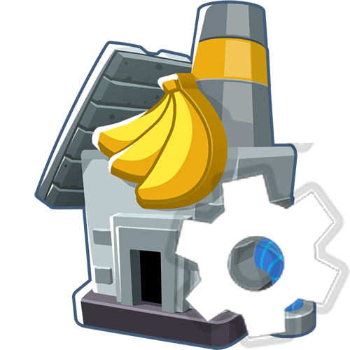

<h1 align="center">

FactoryCore
</h1>

<h2 align="center">
 A library for creating custom content 

</h2>

<h3 align="center">
Documentation coming soon probably
</h3>

# - Support
If you want to contact me, join the [discord](https://discord.gg/3nKPfw6mxt)

